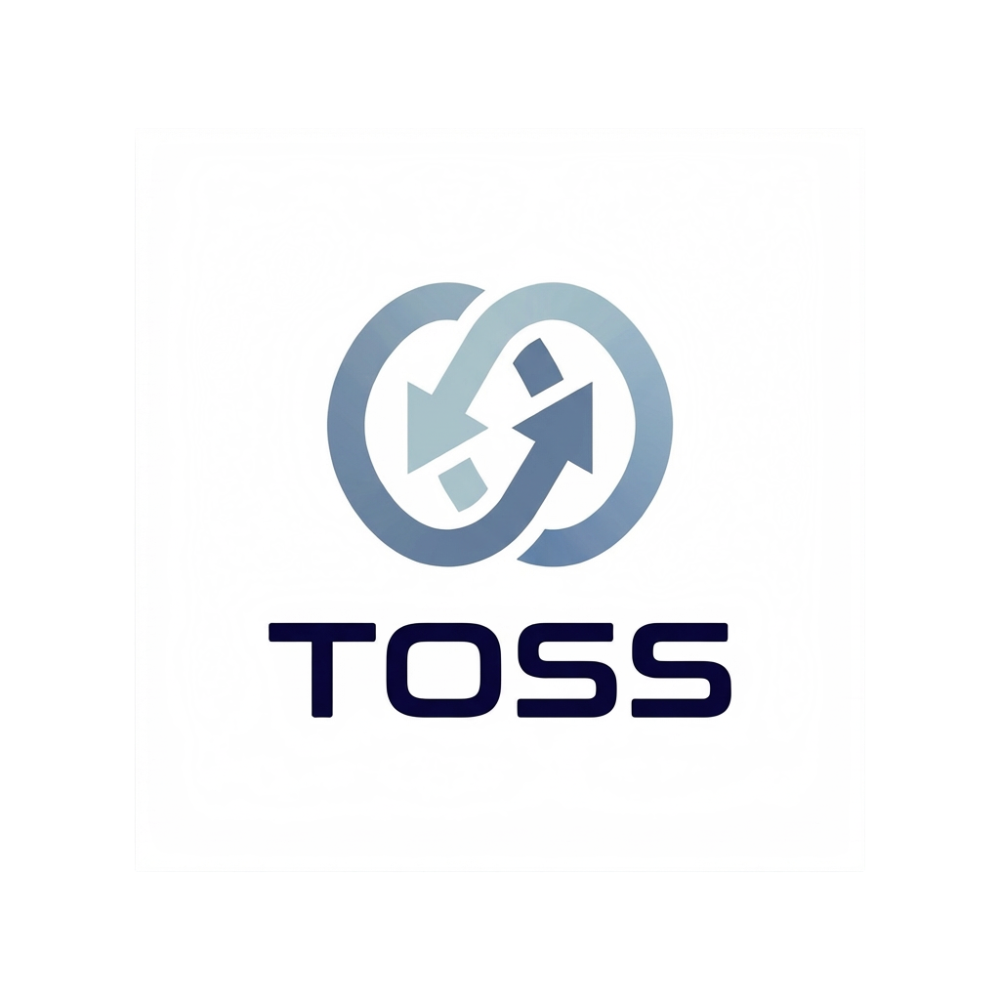

# Toss - 跨设备传输

<p align="center">
  
</p>

<p align="center">
  简单、快速、安全的跨设备文件和文本传输工具
</p>

<p align="center">
  🔒 端到端加密 · ⚡ 设备直传 · 📱 跨平台 · 💻 支持 PWA
</p>

## ✨ 特性

- **设备直传** - 基于 WebRTC 技术，传输内容优先在设备间直接发送
- **端到端加密** - 数据传输全程加密，并提供会话指纹供两端人工核对
- **连接链路可见** - 可查看当前连接是局域网直连、P2P 穿透还是服务器中转
- **无文件大小限制** - 传输速度取决于您的网络环境与当前连接方式
- **跨平台支持** - 支持手机、平板、电脑等任何现代浏览器设备
- **PWA 支持** - 可安装为本地应用，支持系统分享功能
- **暗色模式** - 支持浅色/深色主题切换
- **简洁易用** - 6 位房间代码，一键创建或加入

## 🖼️ 预览

创建或加入房间后，即可在设备间自由传输文本和文件：

- 📝 发送文本消息
- 📁 传输任意类型文件
- 🖼️ 图片预览与下载
- 📋 一键复制房间代码

## 🚀 快速开始

### 环境要求

- Node.js 18+
- pnpm (推荐) 或 npm

### 安装

```bash
# 克隆项目
git clone https://github.com/your-username/toss.git
cd toss

# 安装依赖
pnpm install
```

### 运行

```bash
# 开发模式
pnpm dev

# 构建生产版本
pnpm build

# 运行生产版本
pnpm start
```

访问 http://localhost:3000 即可使用。

## 📖 使用方法

### 基本流程

1. **创建房间** - 在一台设备上点击「创建房间」，获得 6 位房间代码
2. **加入房间** - 在另一台设备上输入房间代码并点击「加入」
3. **开始传输** - 连接成功后，即可发送文本或文件

### PWA 安装

在支持 PWA 的浏览器（如 Chrome、Edge、Safari）中，可以将 Toss 安装为本地应用：

- **桌面端**: 点击地址栏右侧的安装图标
- **移动端**: 使用浏览器菜单中的「添加到主屏幕」

### 系统分享 (Web Share Target)

安装 PWA 后，可以直接从其他应用分享文件到 Toss：

1. 在任意应用中选择「分享」
2. 选择 Toss 作为分享目标
3. 内容会自动加载，连接设备后即可发送

## 🛠️ 技术栈

- **框架**: [Next.js 16](https://nextjs.org/) + [React 19](https://react.dev/)
- **样式**: [Tailwind CSS 4](https://tailwindcss.com/)
- **UI 组件**: [Radix UI](https://www.radix-ui.com/)
- **P2P 通信**: [PeerJS](https://peerjs.com/) (WebRTC)
- **图标**: [Lucide React](https://lucide.dev/)
- **主题**: [next-themes](https://github.com/pacocoursey/next-themes)

## 📁 项目结构

```
├── app/                    # Next.js App Router
│   ├── page.tsx           # 主页面
│   ├── layout.tsx         # 根布局
│   ├── share/             # Web Share Target API 路由
│   └── globals.css        # 全局样式
├── components/            # React 组件
│   ├── room-panel.tsx     # 房间面板（创建/加入）
│   ├── transfer-panel.tsx # 传输面板（消息列表）
│   ├── transfer-item.tsx  # 传输项（文本/文件）
│   └── ui/                # 基础 UI 组件
├── lib/                   # 工具库
│   ├── transfer-context.tsx # 传输状态管理
│   ├── types.ts           # TypeScript 类型
│   └── utils.ts           # 工具函数
├── hooks/                 # 自定义 Hooks
│   └── use-share-target.ts # Web Share Target Hook
├── public/                # 静态资源
│   ├── manifest.json      # PWA 配置
│   └── sw.js              # Service Worker
└── styles/                # 样式文件
```

## 🔒 安全说明

- **传输内容**：文本和文件内容优先通过 WebRTC 数据通道在设备间直接发送，不由 Toss 服务端存储。
- **连接建立**：建立连接时需要通过 PeerJS 信令服务器交换建链信息。信令仅用于协调连接，不承载实际传输内容。
- **连接方式**：根据网络环境不同，实际链路可能表现为局域网直连、NAT 穿透后的 P2P 直连，或经 TURN 服务器中转。
- **链路加密**：所有 WebRTC 数据通道默认启用 DTLS 加密；即使在 TURN 中转场景下，传输链路仍受 WebRTC 加密保护。
- **会话校验**：连接建立后会显示短会话指纹，可在两端人工核对当前会话是否一致。

## 🧭 连接模型

为了避免歧义，可以把 Toss 的连接过程理解成两段：

1. **先建立连接**：应用通过信令服务交换建链信息，让两台设备找到彼此。
2. **再传输内容**：连接建立后，文本和文件通过 WebRTC 链路传输，默认不在 Toss 服务端存储。

当网络限制较少时，链路通常会直接建立在两台设备之间；当网络限制较强时，链路可能回退到 TURN 中转，但传输仍由 WebRTC 加密保护。

## 🤝 贡献

欢迎提交 Issue 和 Pull Request！

## 📄 许可证

[MIT License](LICENSE)

---

<p align="center">
  Made with ❤️ for seamless cross-device transfer
</p>
